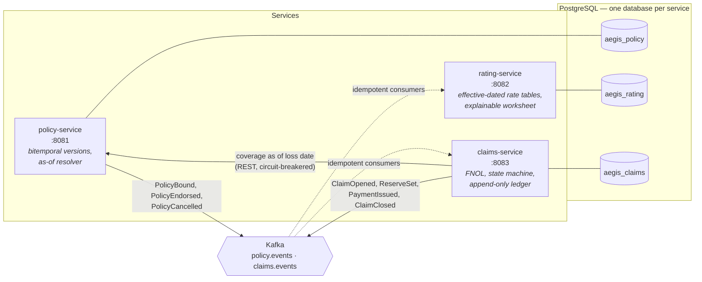

# Aegis Core

A cloud-native Property & Casualty insurance platform: policy administration, rating and
claims, as three independently deployable Spring Boot services on Java 21.

## The problem it exists to solve

A claim arrives on 3 August reporting a collision that happened on **12 March**. Between March
and August the policy was endorsed twice — the collision limit was raised in May, and a driver
was added in June. One of those endorsements was itself backdated, recorded in July but
effective from April.

Which coverage limit applies to this loss?

The answer is the one that was in force **on 12 March**, and getting it wrong is not a rounding
error — it is paying a claim that was not covered, or denying one that was. Aegis Core never
mutates a policy. Binding creates version 1; every endorsement appends a new version with its
own effective date; cancellation appends a terminal version. Each version records both when
its terms applied in the real world (*valid time*) and when the system learned about them
(*transaction time*), so the platform can answer not just "what was covered on 12 March" but
"what did we *believe* on 1 June was covered on 12 March".

That is bitemporal modelling, and it is the one genuinely hard idea in this repository.

## Architecture



Each service reaches only its own database. `policy_svc` has no `CONNECT` grant on
`aegis_claims`, so the boundary is enforced by PostgreSQL rather than by code review — see
[ADR 0001](docs/adr/0001-service-per-database.md).

## Repository layout

```
contracts/          Money value object; event schemas and shared DTOs
policy-service/     Policy administration
rating-service/     Premium calculation
claims-service/     Claims handling
buildSrc/           Gradle convention plugins — build policy lives here, once
infra/postgres/     Database and role bootstrap
docs/adr/           Architecture Decision Records
```

## Running it locally

**Requirements:** Docker, and a Java 21 JDK. `make` finds a JDK automatically from
`/usr/libexec/java_home` or `~/.jdks`; otherwise export `JAVA_HOME` yourself.

```bash
make up             # PostgreSQL + Kafka, blocking until both are actually serving
make verify-stack   # prove it: list the databases and query the Kafka broker
make build          # compile, test, format-check, static-analyse, coverage gate
make down           # stop (make reset also deletes the volumes)
make help           # everything else
```

`make build` runs exactly what CI runs, in the same order, so CI cannot fail for a reason you
could not have reproduced first.

## Engineering standards

These are enforced by the build, not aspirational:

| Standard | How it is enforced |
|---|---|
| Java 21 toolchain | Gradle toolchain, auto-provisioning disabled |
| Consistent formatting | Spotless + palantir-java-format, checked in `build` |
| Static analysis | SpotBugs at max effort, high-confidence findings only |
| Test coverage ≥ 80% line | JaCoCo verification wired into `check` |
| Money is never a `double` | `Money` value object; `BigDecimal` with HALF_EVEN, declared once |
| Database isolation | Separate databases and roles; `CONNECT` revoked from `PUBLIC` |

## Status

Built in milestones, each ending in a green build.

| # | Milestone | Status |
|---|---|---|
| 1 | Gradle multi-module skeleton, `contracts` + `Money`, local stack, CI | **Done** |
| 2 | policy-service: schema, Flyway, bitemporal versioning, as-of resolver | **Done** |
| 3 | rating-service: rate tables, rule engine, worksheet, property-based tests | **Done** |
| 4 | claims-service: FNOL, state machine, ledger, coverage verification | Pending |
| 5 | Kafka: transactional outbox, idempotent consumers, DLQ, contract tests | Pending |
| 6 | Resilience4j, JWT security, idempotency keys, tracing and metrics | Pending |
| 7 | Kubernetes manifests, `kind` smoke test in CI, demo script, `INTERVIEW.md` | Pending |

policy-service and rating-service expose full REST APIs with committed OpenAPI 3.1 documents;
claims-service currently exposes health and build-info only. The `curl` demo script that tells
the coverage-as-of-loss-date story end to end arrives with milestone 7.
